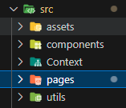
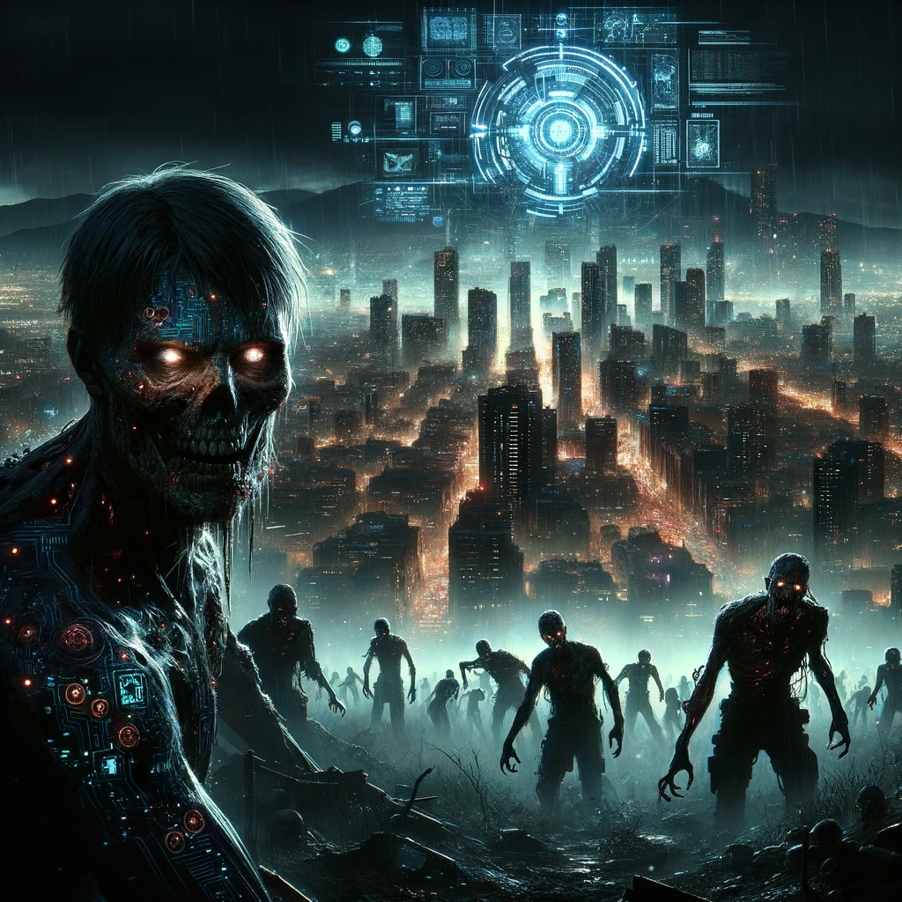

# Code of the Undead: Firewall of Resilience

Valiant Protectors of the Digital Realm,

As the darkness of the zombie apocalypse descends, our city's lifeline hinges on the prowess of your code. We call upon you, the dauntless coders and guardians of humanity's last stronghold, to wield your skills and activate the ancient carousel shield—the digital bastion against the encroaching undead.

Armed with React's agility, TypeScript's might, and Framer Motion's grace, you will embark on Operation Firewall, a critical mission to construct an impregnable defense system. Your code will breathe life into the animated interfaces that stand vigilant over our city's safety. This is not merely a call to action—it is a summons to become part of a legend.

In our hour of need, as the undead evolve and threaten to breach our walls, your mission is paramount. With every line of code, you will fortify our defenses, build our resilience, and etch your name alongside the heroes of our age. Rise, coders, for your time is now, and the future—our city's very survival—rests in the strength of your keystrokes.

Stand with us, and together, let us cast a Firewall of Resilience that will echo through eternity.

May the code empower you.

# Mission Initialization

Valiant Protectors of the Digital Fortress, our sanctuary city, a bastion of hope in a world besieged by the undead, teeters perilously at the edge of a digital abyss. Your arsenal in this epic battle? A symphony of keystrokes, crafting the very essence of React's powerful magic. Your sacred quest is to animate the lifeblood of our defenses – the enigmatic carousel shield, an intricate tapestry woven from the fabric of React.

The repository of ancient scripts awaits your command, holding within its depths the foundational grimoire for your React journey. This tome is your beacon, guiding you through the arcane intricacies of React, a path that holds the key to fortifying our city's digital ramparts. Rise, brave code warriors, for in your mastery of React, our city finds its shield against the encroaching darkness.

**Invoke the Creation Ritual.** Begin your arcane quest by invoking the `npx create-react-app` spell with the `--template typescript` incantation, conjuring the foundational structure of your React fortress. This sacred rite will lay the groundwork for your TypeScript-powered sanctuary.

```js
npx create-react-app react-context --template typescript
```

**Journey to the React Bastion.** With the realm created, navigate to your newly formed citadel by entering the `cd your-app-name` command. Here, in this digital fortress, you will harness the powers of React and TypeScript to craft your defenses.

**Summon the Tailwind Spirits.** Invoke the mystical Tailwind CSS by casting `npm install tailwindcss postcss autoprefixer` followed by `npx tailwindcss init -p`. This spell weaves the essence of Tailwind into your domain, granting you the power to style your bastion with elegance and speed.

```js
npm install -D tailwindcss
npx tailwindcss init
```

In the tailwind.config.js file paste this snippet.

```css
/** @type {import('tailwindcss').Config} */
module.exports = {
  content: [
    "./src/**/*.{js,jsx,ts,tsx}",
  ],
  theme: {
    extend: {},
  },
  plugins: [],
}
```

In the Index.css file paste the Tailwind Directives.

```css
@tailwind base;
@tailwind components;
@tailwind utilities;
```

Test that Tailwind has been installed correctly. Replace boilerplate code in App.tsx with this test code.

```js
<h1 className='text-3xl font-bold underline'> Hello world! </h1>
```

**Channel the Framer Motion Essence.** To imbue your sanctuary with life, summon the Framer Motion spirits using `npm install framer-motion`. This enchantment will bestow upon your creations the ability to move and transform, breathing life into your digital constructs.

```js
npm install framer-motion
```

**Bind the Scroll of React.** Call forth the ancient scroll of React-Scroll by casting `npm install react-scroll`. This arcane script will allow your fortress's inhabitants to navigate through its vastness with ease, traversing the digital landscape as if carried by the wind.

```js
npm install react-scroll
npm install @types/react-scroll
```

**Conjure the AOS (Animate On Scroll) Magic.** In your quest to fortify the digital fortress, summon the mystical energies of Animate On Scroll (AOS) by casting the incantation `npm install aos`. This powerful spell will infuse your realm with the ability to animate elements as they enter the viewport, imbuing your fortress with a dynamic, living essence.

```js
npm install aos
npm install @types/aos
```

**Test Your Magical Constructs.** With your spells cast and your defenses fortified, invoke `npm start` to breathe life into your creation. Witness as your digital fortress takes shape, with each enchantment from Tailwind's styling to Framer Motion's animations working in unison to repel the impending digital onslaught. From here, you will channel the combined powers of React, TypeScript, Tailwind, and Framer Motion,

Stand ready, brave coder. Your skills in the arcane arts of React, TypeScript, and the allied libraries are the bulwark against the darkness. May your code hold strong against the tide of the undead.

# Mission Start

## Setup Folder Structure

In your `src` directory, you'll want to create directories for `assets`, `components`, `pages`, `utils`, and `context`.



## Update Tailwind Config and Import Fonts

While Tailwind has a pretty vast library of colors, fonts, shadows, etc., it does give you the ability to add your own. To prepare us for what's coming later we're going to pre-emptively add colors, a default font, and a box-shadow, so you can how to add custom CSS to your application that is using Tailwind CSS.

Add fonts to index.html -

```js
<!-- font import -->
<link rel="preconnect" href="https://fonts.googleapis.com" />
<link rel="preconnect" href="https://fonts.gstatic.com" crossorigin />
<link
  href="https://fonts.googleapis.com/css2?family=Lexend:wght@400;500;600;700&display=swap"
  rel="stylesheet"
/>
```

tailwind.config.js -

```js
/** @type  {import('tailwindcss').Config} */
module.exports = {
  content: ['./src/**/*.{js,jsx,ts,tsx}'],
  theme: {
    extend: {
      colors: {
        'primary-green': '#0C4B23',
        'secondary-green': '#22CE61',
      },
      boxShadow: {
        custom:
          'rgba(50, 50, 93, 0.25) 0px 2px 5px -1px, rgba(0, 0, 0, 0.3) 0px 1px 3px -1px;',
      },
    },
    fontFamily: {
      sans: ['Lexend', 'sans-serif'],
    },
    // enables manual dark mode
    darkMode: 'class',
  },
  plugins: [],
};
```

## useMediaQuery
Our last bit of setup, for now, will be adding the `useMediaQuery` hook to our utils directory. The `useMediaQuery` hook is a custom hook is used for responsive design. It basically is a way for you listen for a match to a CSS media query and conditionally render your UI accordingly.

useMediaQuery.tsx -
```js
import { useEffect, useState } from 'react';

export function useMediaQuery(query: string): boolean {
  const getMatches = (query: string): boolean => {
    // Prevents SSR issues
    if (typeof window !== 'undefined') {
      return window.matchMedia(query).matches;
    }
    return false;
  };

  const [matches, setMatches] = useState<boolean>(getMatches(query));

  function handleChange() {
    setMatches(getMatches(query));
  }

  useEffect(() => {
    const matchMedia = window.matchMedia(query);

    // Triggered at the first client-side load and if query changes
    handleChange();

    // Listen matchMedia
    matchMedia.addEventListener('change', handleChange);

    return () => {
      // Remove event listener
      matchMedia.removeEventListener('change', handleChange);
    };
    // eslint-disable-next-line react-hooks/exhaustive-deps
  }, [query]);

  return matches;
}
```

## Create First Component and First Page

The first page we're going to make is the `Sections.tsx` page. This is where we're going to be importing our components as we build them out. After making this page, import it in your `App.tsx` file.

Sections.tsx -

```js
import React from 'react';

const Sections = () => {
  return <div>Sections</div>;
};

export default Sections;
```

App.tsx -

```js
function App() {
  return (
    <>
      <Sections />
    </>
  );
}

export default App;
```

## Building Out The Nav

The navbar is going to be the meat and potatoes of this code along. We're going to be building out the navbar using Framer Motion and React Smooth Scroll. First, you'll see how to build out the navbar using the `useState` hook and then we'll refactor it to use Context.

Nav.tsx -

```js
import React from 'react';

const Nav = () => {
  return <div>Nav</div>;
};

export default Nav;
```

### Import Dependencies, Setup State, Setup Framer Variants

Before we get into building out the UI lets import the dependencies we'll need, initialize some state, and instantiate a variable for our useMediaQuery hook in our `Nav.tsx` component.

Imports -

```js
import { useState, useEffect } from 'react';
import { motion, AnimatePresence } from 'framer-motion';
import { useMediaQuery } from '../utils/useMediaQuery';
import { Link } from 'react-scroll';
import NSLogo from '../assets/NSLogo.png';
```

useMediaQuery Hook and State -

```js
// media query hook
const isDesktop = useMediaQuery('(min-width: 1024px)');
// hamburger menu toggle state
const [toggled, setToggled] = useState<boolean>(false);
// state for background change on scroll
const [scrollBackground, setScrollBackground] = useState<boolean>(false);
```

### React Smooth Scroll

Since our React application is a single scrollable page we'll be implementing smooth scrolling, with React-Scroll, to navigate it. React-Scroll is a package that allows you to easily setup a smooth scrolling animation in your application. As we build out the nav and hero components you'll see `<Link></Link>` tags being used. While it looks exactly like Link tags in React Router (or Next Router for those of you using it), instead of routing to a different page it's routed to an anchor that is set in each component, for example id='home' in the hero component. You can learn more about it [here](https://www.npmjs.com/package/react-scroll).

Example React-Scroll Link tag -

```js
<Link to='home' duration={0} smooth={true} className='cursor-pointer'>
  Home
</Link>
```

### Framer Motion

Framer Motion is powerful animation library for React applications through the use of `motion` components, for example `motion.div`, as you'll be using to animate the navbar component in this lesson. If you'd like to learn more about Framer Motion you can view the docs [here](https://www.framer.com/motion/introduction/).

In this lesson you'll be using `variants` and `animate` to animate some of the elements in this nav component. A variant is essentialy a JavaScript object of key value pairs that can be used to define multiple states of style. Variants are handy when you need to handle multiple animated states. Animate is a prop you can pass a component to have it animate from it's current style to a target style.

#### Variants -

The two variants you'll be creating are a `navMotion` variant and a `navItemMotion` variant. The `navMotion` variant is going to handle the animation states for the nav container and staggering the animation for it's children, the nav links. The `navItemMotion` variant is going to handle the animation states for the nav links.
navMotion and navItemMotion variants -

```js
// framer variants
// nav variant
const navMotion = {
  // initial state - hidden
  hidden: {
    y: '100%',
    opacity: 0,
    transition: {
      duration: 0.5,
      staggerChildren: 0.15,
      ease: 'easeInOut',
    },
  },
  // active state - visible
  visible: {
    y: 0,
    opacity: 1,
    transition: {
      duration: 0.5,
      when: 'beforeChildren',
      staggerChildren: 0.15,
      ease: 'easeInOut',
    },
  },
  // exit state - exit
  exit: {
    y: '100%',
    opacity: 0,
    transition: {
      duration: 0.5,
      when: 'afterChildren',
      staggerChildren: 0.15,
      staggerDirection: -1,
      ease: 'easeInOut',
    },
  },
};

// nav item variant
const navItemMotion = {
  // initial state - hidden
  hidden: {
    opacity: 0,
    y: 100,
    transition: {
      duration: 0.5,
      ease: 'easeInOut',
    },
  },
  // active state - visible
  visible: {
    opacity: 1,
    y: 0,
    transition: {
      duration: 0.5,
      ease: 'easeInOut',
    },
  },
  // exit state - exit
  exit: {
    opacity: 0,
    y: 50,
    transition: {
      duration: 0.5,
      ease: 'easeInOut',
    },
  },
};
```

#### Checkpoint

The `Nax.tsx` component should currently look like this -

```js
import { useState, useEffect } from 'react';
import { motion, AnimatePresence } from 'framer-motion';
import { useMediaQuery } from '../utils/useMediaQuery';
import { Link } from 'react-scroll';
import NSLogo from '../assets/NSLogo.png';

// framer variants
// nav variant
const navMotion = {
  // initial state - hidden
  hidden: {
    y: '100%',
    opacity: 0,
    transition: {
      duration: 0.5,
      staggerChildren: 0.15,
      ease: 'easeInOut',
    },
  },
  // active state - visible
  visible: {
    y: 0,
    opacity: 1,
    transition: {
      duration: 0.5,
      when: 'beforeChildren',
      staggerChildren: 0.15,
      ease: 'easeInOut',
    },
  },
  // exit state - exit
  exit: {
    y: '100%',
    opacity: 0,
    transition: {
      duration: 0.5,
      when: 'afterChildren',
      staggerChildren: 0.15,
      staggerDirection: -1,
      ease: 'easeInOut',
    },
  },
};

// nav item variant
const navItemMotion = {
  // initial state - hidden
  hidden: {
    opacity: 0,
    y: 100,
    transition: {
      duration: 0.5,
      ease: 'easeInOut',
    },
  },
  // active state - visible
  visible: {
    opacity: 1,
    y: 0,
    transition: {
      duration: 0.5,
      ease: 'easeInOut',
    },
  },
  // exit state - exit
  exit: {
    opacity: 0,
    y: 50,
    transition: {
      duration: 0.5,
      ease: 'easeInOut',
    },
  },
};

const Nav = () => {
  // media query hook
  const isDesktop = useMediaQuery('(min-width: 1024px)');
  // hamburger menu toggle state
  const [toggled, setToggled] = useState<boolean>(false);
  // state for background change on scroll
  const [scrollBackground, setScrollBackground] = useState<boolean>(false);
  return <div>Nav</div>;
};

export default Nav;
```

### Conditionally Creating The Nav

At this point you'll currently have most of the logic you'll need to make this nav work minus some logic that will be added once there is actually a navbar to interact with.

Let's start conditionally creating the nav. We'll start by creating the nav container. Update the `div` to a `nav` and add in some styles.

```js
<nav className='bg-white h-14 w-[calc(100%-2rem)] fixed top-0 left-4 z-10 flex items-center justify-between p-8 font-medium my-2 transition ease-in-out duration-200'></nav>
```

#### Conditional Rendering with useMediaQuery hook

Using the variable that we instantiated, `isDesktop` we can build out our nav and have it styled differently depending on whether or not the viewport is greater than or less than 1024px. We'll be creating a view for `isDesktop` (Desktop/Laptop), `!isDesktop` (Tablet/Mobile), and the `toggled && !isDesktop`.

isDesktop -

```js
{
  /* navbar if desktop */
}
{
  isDesktop && (
    <>
      <Link to='home' duration={0} smooth={true} className='cursor-pointer'>
        <div className='flex items-center justify-center'>
          
          <div className='flex flex-col justify-center -mx-2 leading-4'>
            <h1 className='font-black text-primary-green'>Neurosynth</h1>
            <h1 className='font-normal'>Dynamics</h1>
          </div>
        </div>
      </Link>
      <div className='flex items-center gap-4 text-sm'>
        <Link
          to='about'
          duration={0}
          smooth={true}
          className='cursor-pointer text-base hover:text-primary-green transition duration-200'
        >
          Learn More
        </Link>
        <Link to='contact' duration={0} smooth={true} className=''>
          <button className='bg-primary-green text-white hover:bg-green-700 px-3.5 py-2.5 shadow-custom shadow-primary-green transition duration-200'>
            Contact Us
          </button>
        </Link>
      </div>
    </>
  );
}
```

!isDesktop -

```js
{
  /* navbar for tablet and below */
}
{
  /* hamburger icon */
}
{
  !isDesktop && (
    <div className='flex items-center justify-between w-full'>
      <Link
        to='home'
        smooth={true}
        duration={0}
        className='cursor-pointer'
        onClick={() => setToggled(false)}
      >
        <div className='flex items-center justify-center'>
          
          <div className='flex flex-col justify-center -mx-2 leading-4'>
            <h1 className='font-black text-primary-green'>Neurosynth</h1>
            <h1 className='font-normal'>Dynamics</h1>
          </div>
        </div>
      </Link>
      <div
        onClick={() => setToggled((prevToggled) => !prevToggled)}
        className='space-y-1.5 cursor-pointer z-50'
      >
        <motion.span
          animate={{ rotateZ: toggled ? 45 : 0, y: toggled ? 8 : 0 }}
          className='block h-0.5 w-8 bg-black'
        ></motion.span>
        <motion.span
          animate={{ scale: toggled ? 0 : 1 }}
          className='block h-0.5 w-8 bg-black'
        ></motion.span>
        <motion.span
          animate={{
            rotateZ: toggled ? -45 : 0,
            y: toggled ? -8 : 0,
          }}
          className='block h-0.5 w-8 bg-black'
        ></motion.span>
      </div>
    </div>
  )
}
```

toggled and !isDesktop -

```js
<AnimatePresence>
  {/* nav container */}
  {toggled && !isDesktop && (
    <motion.div
      variants={navMotion}
      initial='hidden'
      animate='visible'
      exit='exit'
      className='fixed top-[80px] left-4 w-[calc(100%-2rem)] h-screen flex items-center justify-center z-10 shadow-custom shadow-primary-green bg-white outline-primary-green'
    >
      {/* nav links container */}
      <div className='flex flex-col items-center justify-center gap-12 h-full'>
        <motion.div variants={navItemMotion}>
          <Link
            to='about'
            smooth={true}
            className='cursor-pointer text-2xl sm:text-4xl'
            onClick={() => setToggled(false)}
          >
            Learn More
          </Link>
        </motion.div>
        <motion.div variants={navItemMotion}>
          <Link to='contact' smooth={true} onClick={() => setToggled(false)}>
            <button className='bg-primary-green text-white hover:bg-green-700 px-3.5 py-2.5 sm:p-4 shadow-custom shadow-primary-green transition duration-200 text-2xl sm:text-4xl'>
              Join Trial
            </button>
          </Link>
        </motion.div>
      </div>
    </motion.div>
  )}
</AnimatePresence>
```

Remember that logic we'd be adding after the nav was built? Let's add that to our navbar. We're going to be adding two things, a style change to the nav when you scroll and some logic to prevent a user from scrolling when the mobile nav container is open.

changeBackground and eventListener -

```js
// change background function
const changeBackground = () => {
  if (window.scrollY > 50) {
    setScrollBackground(true);
  } else {
    setScrollBackground(false);
  }
};

// event listener for scroll
window.addEventListener('scroll', changeBackground);
```

useEffect -

```js
// useEffect for preventing scroll when nav is toggled
useEffect(() => {
  if (toggled) {
    document.body.style.overflow = 'hidden';
  } else {
    document.body.style.overflow = 'auto';
  }
}, [toggled]);
```

Update the nav container to include the scrollBackground state - 

```js
    <nav
      className={`bg-white h-14 w-[calc(100%-2rem)] fixed top-0 left-4 z-10 flex items-center justify-between p-8 font-medium my-2 transition ease-in-out duration-200 ${
        scrollBackground ? 'shadow-custom shadow-primary-green' : ''
      }`}
    >
```

### Checkpoint

At this point your navbar should be built and responsive. What'll be coming next is building out some more components so you can see how React-Scroll works, setting up Animate on Scroll (AOS), and refactoring the nav logic to use Context.

Current `Nax.tsx` code -

```js
import { useState, useEffect } from 'react';
import { motion, AnimatePresence } from 'framer-motion';
import { useMediaQuery } from '../utils/useMediaQuery';
import { Link } from 'react-scroll';
import NSLogo from '../assets/NSLogo.png';

// framer variants
// nav variant
const navMotion = {
  // initial state - hidden
  hidden: {
    y: '100%',
    opacity: 0,
    transition: {
      duration: 0.5,
      staggerChildren: 0.15,
      ease: 'easeInOut',
    },
  },
  // active state - visible
  visible: {
    y: 0,
    opacity: 1,
    transition: {
      duration: 0.5,
      when: 'beforeChildren',
      staggerChildren: 0.15,
      ease: 'easeInOut',
    },
  },
  // exit state - exit
  exit: {
    y: '100%',
    opacity: 0,
    transition: {
      duration: 0.5,
      when: 'afterChildren',
      staggerChildren: 0.15,
      staggerDirection: -1,
      ease: 'easeInOut',
    },
  },
};

// nav item variant
const navItemMotion = {
  // initial state - hidden
  hidden: {
    opacity: 0,
    y: 100,
    transition: {
      duration: 0.5,
      ease: 'easeInOut',
    },
  },
  // active state - visible
  visible: {
    opacity: 1,
    y: 0,
    transition: {
      duration: 0.5,
      ease: 'easeInOut',
    },
  },
  // exit state - exit
  exit: {
    opacity: 0,
    y: 50,
    transition: {
      duration: 0.5,
      ease: 'easeInOut',
    },
  },
};
const Nav = () => {
  // media query hook
  const isDesktop = useMediaQuery('(min-width: 1024px)');
  // hamburger menu toggle state
  const [toggled, setToggled] = useState<boolean>(false);
  // state for background change on scroll
  const [scrollBackground, setScrollBackground] = useState<boolean>(false);

  // change background function
  const changeBackground = () => {
    if (window.scrollY > 50) {
      setScrollBackground(true);
    } else {
      setScrollBackground(false);
    }
  };

  // event listener for scroll
  window.addEventListener('scroll', changeBackground);

  // useEffect for preventing scroll when nav is toggled
  useEffect(() => {
    if (toggled) {
      document.body.style.overflow = 'hidden';
    } else {
      document.body.style.overflow = 'auto';
    }
  }, [toggled]);

  return (
    <nav
      className={
        scrollBackground
          ? 'bg-white h-14 w-[calc(100%-2rem)] fixed top-0 left-4 z-10 flex items-center justify-between p-8 font-medium my-2 transition ease-in-out duration-200 shadow-custom shadow-primary-green'
          : 'bg-white h-14 w-[calc(100%-2rem)] fixed top-0 left-4 z-10 flex items-center justify-between p-8 font-medium my-2 transition ease-in-out duration-200'
      }
    >
      {/* navbar if desktop */}
      {isDesktop && (
        <>
          <Link to='home' duration={0} smooth={true} className='cursor-pointer'>
            <div className='flex items-center justify-center'>
              
              <div className='flex flex-col justify-center -mx-2 leading-4'>
                <h1 className='font-black text-primary-green'>Neurosynth</h1>
                <h1 className='font-normal'>Dynamics</h1>
              </div>
            </div>
          </Link>
          <div className='flex items-center gap-4 text-sm'>
            <Link
              to='about'
              duration={0}
              smooth={true}
              className='cursor-pointer text-base hover:text-primary-green transition duration-200'
            >
              Learn More
            </Link>
            <Link to='contact' duration={0} smooth={true} className=''>
              <button className='bg-primary-green text-white hover:bg-green-700 px-3.5 py-2.5 shadow-custom shadow-primary-green transition duration-200'>
                Contact Us
              </button>
            </Link>
          </div>
        </>
      )}

      {/* navbar for tablet and below */}
      {/* hamburger icon */}
      {!isDesktop && (
        <div className='flex items-center justify-between w-full'>
          <Link
            to='home'
            smooth={true}
            duration={0}
            className='cursor-pointer'
            onClick={() => setToggled(false)}
          >
            <div className='flex items-center justify-center'>
              
              <div className='flex flex-col justify-center -mx-2 leading-4'>
                <h1 className='font-black text-primary-green'>Neurosynth</h1>
                <h1 className='font-normal'>Dynamics</h1>
              </div>
            </div>
          </Link>
          <div
            onClick={() => setToggled((prevToggled) => !prevToggled)}
            className='space-y-1.5 cursor-pointer z-50'
          >
            <motion.span
              animate={{ rotateZ: toggled ? 45 : 0, y: toggled ? 8 : 0 }}
              className='block h-0.5 w-8 bg-black'
            ></motion.span>
            <motion.span
              animate={{ scale: toggled ? 0 : 1 }}
              className='block h-0.5 w-8 bg-black'
            ></motion.span>
            <motion.span
              animate={{
                rotateZ: toggled ? -45 : 0,
                y: toggled ? -8 : 0,
              }}
              className='block h-0.5 w-8 bg-black'
            ></motion.span>
          </div>
        </div>
      )}

      {/* hamburger menu */}
      <AnimatePresence>
        {/* nav container */}
        {toggled && !isDesktop && (
          <motion.div
            variants={navMotion}
            initial='hidden'
            animate='visible'
            exit='exit'
            className='fixed top-[80px] left-4 w-[calc(100%-2rem)] h-screen flex items-center justify-center z-10 shadow-custom shadow-primary-green bg-white outline-primary-green'
          >
            {/* nav links container */}
            <div className='flex flex-col items-center justify-center gap-12 h-full'>
              <motion.div variants={navItemMotion}>
                <Link
                  to='about'
                  smooth={true}
                  className='cursor-pointer text-2xl sm:text-4xl'
                  onClick={() => setToggled(false)}
                >
                  Learn More
                </Link>
              </motion.div>
              <motion.div variants={navItemMotion}>
                <Link
                  to='contact'
                  smooth={true}
                  onClick={() => setToggled(false)}
                >
                  <button className='bg-primary-green text-white hover:bg-green-700 px-3.5 py-2.5 sm:p-4 shadow-custom shadow-primary-green transition duration-200 text-2xl sm:text-4xl'>
                    Join Trial
                  </button>
                </Link>
              </motion.div>
            </div>
          </motion.div>
        )}
      </AnimatePresence>
    </nav>
  );
};

export default Nav;
```

## Building Out The Rest Of The Components

In your components directory create the following -

Hero.tsx -

```js
import { Link } from 'react-scroll';

const Hero = () => {
  return (
    <div id='home' className='min-h-screen flex items-center justify-center'>
      <div className='px-4'>
        <h1 className='text-primary-green text-5xl font-bold tracking-widest sm:text-7xl md:text-8xl'>
          Neurosynth
        </h1>
        <h1 className='text-5xl tracking-widest sm:text-7xl md:text-8xl'>
          Dynamics
        </h1>
        <p className='mt-4 font-bold text-xl sm:text-2xl tracking-widest '>
          Engineering Evolution, Beyond Imagination
        </p>
        <div className='flex items-center gap-4 mt-4'>
          <Link
            to='contact'
            smooth={true}
            duration={0}
            className='cursor-pointer'
          >
            <button className='bg-primary-green text-white text-xl hover:bg-green-700 px-3.5 py-2.5 shadow-custom shadow-primary-green transition duration-200'>
              Join Trial
            </button>
          </Link>
          <Link
            to='about'
            smooth={true}
            duration={0}
            className='cursor-pointer'
          >
            <button className='text-xl font-semibold leading-6 hover:text-primary-green transition duration-200'>
              Learn more <span aria-hidden='true'>→</span>
            </button>
          </Link>
        </div>
      </div>
    </div>
  );
};

export default Hero;
```

About.tsx -

```js
import React from 'react';

const About = () => {
  return (
    <div id='about' className='min-h-screen flex items-center justify-center'>
      <div className='mx-auto max-w-7xl px-6 lg:px-8'>
        <div className='mx-auto max-w-2xl lg:mx-0'>
          <h2 className='text-4xl font-bold tracking-tight text-primary-green sm:text-6xl'>
            About Us
          </h2>
          <p className='mt-6 text-lg leading-8'>
            At Neurosynth Dynamics, we are at the forefront of biotechnological
            and pharmaceutical innovation, dedicated to the relentless pursuit
            of genetic engineering marvels and cybernetic advancements. Our
            esteemed conglomerate is celebrated for breakthroughs that not only
            push the boundaries of medical science but also integrate
            cutting-edge computational biology to enhance human life. While our
            public endeavors champion medical progress, our clandestine research
            delves into the fusion of technology and biology, creating
            groundbreaking neural-interface technologies and bio-coded materials
            designed to amplify human capabilities beyond current limitations.
          </p>
          <p className='mt-6 text-lg leading-8'>
            In our quest for transcendent innovation, we recognize the profound
            responsibility that accompanies our groundbreaking work. The
            unforeseen emergence of the advanced undead has been a sobering
            consequence, reminding us that the path to progress is fraught with
            complex ethical considerations. At Neurosynth Dynamics, we are
            committed to advancing science with a vigilant eye on the
            implications of our research, ensuring that each step forward is
            taken with the utmost respect for the delicate balance between human
            potential and the natural order.
          </p>
        </div>
      </div>
    </div>
  );
};

export default About;
```

Contact.tsx -

```js
import React from 'react';

const Contact = () => {
  return (
    <div id='contact' className='min-h-screen flex items-center justify-center'>
      <div className='mx-auto max-w-7xl px-6 lg:px-8'>
        <div className='mx-auto max-w-2xl lg:mx-0'>
          <h2 className='text-4xl font-bold tracking-tight text-primary-green sm:text-6xl'>
            Contact Us
          </h2>
          <p className='mt-6 text-lg leading-8'>
            Embrace the frontier of innovation with us—where biotech and pharma
            brilliance converge to redefine tomorrow.
          </p>
          <p className='mt-4 text-lg leading-8'>
            For general inquiries, please email us at {' '}
            <span className='font-bold text-primary-green'>
              info@neurosynthdynamics.com
            </span>
            .
          </p>
          <p className='mt-4 text-lg leading-8'>
            For support, please contact {' '}
            <span className='font-bold text-primary-green'>
              support@neurosynthdynamics.com
            </span>
            .
          </p>
        </div>
      </div>
    </div>
  );
};

export default Contact;

```

Update the Sections.tsx file -

```js
import Nav from '../components/Nav';
import Hero from '../components/Hero';
import About from '../components/About';
import Contact from '../components/Contact';

const Landing = () => {
  return (
    <>
      <Nav />
      <Hero />
      <About />
      <Contact />
    </>
  );
};

export default Landing;
```

## Enter: Animate on Scroll (AOS)

AOS is one of THE simplest ways that you can put some life into your application. It is a small but very useful package that allows you to easily add animations to elements as they appear. It's been a go-to for quick animations for years and always will be, definitely keep this in your back pocket. You can learn more about it [here](https://michalsnik.github.io/aos/).

Import and Initialize AOS in App.tsx -

```js
import Aos from 'aos';
import 'aos/dist/aos.css';
import { useEffect } from 'react;

// initialize AOS
useEffect(() => {
  Aos.init({});
}, []);
```

Putting some life into our elements. We'll be using 3-4 attributes, depending on the element, to implement a staggered fade-in animation.

```js
// effect you're using
data-aos='fade-up'
// durationg of chosen effect
data-aos-duration='500'
// setting this to true will make the animation trigger once
// setting to false will make the animation trigger everytime
// element is in view but can impact performance
data-aos-once='true'
// add delay in 50 ms increments from the second element to the last element
data-aos-delay='50'
```

### Adding AOS to Hero.tsx and About.tsx

Upated Hero.tsx -

```js
const Hero = () => {
  return (
    <div id='home' className='min-h-screen flex items-center justify-center'>
      <div className='px-4'>
        <h1
          data-aos-once='true'
          data-aos='fade-up'
          data-aos-duration='500'
          className='text-primary-green text-5xl font-bold tracking-widest sm:text-7xl md:text-8xl'
        >
          Neurosynth
        </h1>
        <h1
          data-aos='fade-up'
          data-aos-duration='500'
          data-aos-delay='50'
          data-aos-once='true'
          className='text-5xl tracking-widest sm:text-7xl md:text-8xl'
        >
          Dynamics
        </h1>
        <p
          data-aos='fade-up'
          data-aos-duration='500'
          data-aos-delay='100'
          data-aos-once='true'
          className='mt-4 font-bold text-xl sm:text-2xl tracking-widest '
        >
          Engineering Evolution, Beyond Imagination
        </p>
        <div className='flex items-center gap-4 mt-4'>
          <Link
            to='contact'
            smooth={true}
            duration={0}
            className='cursor-pointer'
            data-aos='fade-up'
            data-aos-duration='500'
            data-aos-delay='150'
            data-aos-once='true'
          >
            <button className='bg-primary-green text-white text-xl hover:bg-green-700 px-3.5 py-2.5 shadow-custom shadow-primary-green transition duration-200'>
              Join Trial
            </button>
          </Link>
          <Link
            to='about'
            smooth={true}
            duration={0}
            className='cursor-pointer'
            data-aos='fade-up'
            data-aos-duration='500'
            data-aos-delay='200'
            data-aos-once='true'
          >
            <button className='text-xl font-semibold leading-6 hover:text-primary-green transition duration-200'>
              Learn more <span aria-hidden='true'>→</span>
            </button>
          </Link>
        </div>
      </div>
    </div>
  );
};

export default Hero;
```

Updated About.tsx -

```js
const About = () => {
  return (
    <div id='about' className='min-h-screen flex items-center justify-center'>
      <div className='mx-auto max-w-7xl px-6 lg:px-8'>
        <div className='mx-auto max-w-2xl lg:mx-0'>
          <h2
            data-aos-once='true'
            data-aos='fade-up'
            data-aos-duration='500'
            className='text-4xl font-bold tracking-tight text-primary-green sm:text-6xl'
          >
            About Us
          </h2>
          <p
            data-aos-once='true'
            data-aos='fade-up'
            data-aos-duration='500'
            data-aos-delay='50'
            className='mt-6 text-lg leading-8'
          >
            At Neurosynth Dynamics, we are at the forefront of biotechnological
            and pharmaceutical innovation, dedicated to the relentless pursuit
            of genetic engineering marvels and cybernetic advancements. Our
            esteemed conglomerate is celebrated for breakthroughs that not only
            push the boundaries of medical science but also integrate
            cutting-edge computational biology to enhance human life. While our
            public endeavors champion medical progress, our clandestine research
            delves into the fusion of technology and biology, creating
            groundbreaking neural-interface technologies and bio-coded materials
            designed to amplify human capabilities beyond current limitations.
          </p>
          <p
            data-aos-once='true'
            data-aos='fade-up'
            data-aos-duration='500'
            data-aos-delay='100'
            className='mt-6 text-lg leading-8'
          >
            In our quest for transcendent innovation, we recognize the profound
            responsibility that accompanies our groundbreaking work. The
            unforeseen emergence of the advanced undead has been a sobering
            consequence, reminding us that the path to progress is fraught with
            complex ethical considerations. At Neurosynth Dynamics, we are
            committed to advancing science with a vigilant eye on the
            implications of our research, ensuring that each step forward is
            taken with the utmost respect for the delicate balance between human
            potential and the natural order.
          </p>
        </div>
      </div>
    </div>
  );
};

export default About;
```

## Time To Get Some Context


Context is a state management tool that allows you to share data in different parts of your applicatoin without having to pass it through each component one by one (prop drilling).

### Creating Context

It's time to dust off that `context` directory that you created. What we're going to be doing is taking all of the logic from our Nav.tsx component and placing it a context file.

Import Dependencies -

```js
import {
  createContext,
  useState,
  useEffect,
  Dispatch,
  SetStateAction,
  ReactNode,
  useMemo,
} from 'react';
import { useMediaQuery } from '../utils/useMediaQuery';
```

In the dependencies you'll see some terms you have seen and also some you haven't seen yet. Let's talk about some of them -

```js
createContext; // creates context object for passing data
Dispatch; // a function that takes an action
SetStateAction; // a specific type used when updating state
useMemo; // a hook that can be used to help prevent unnecessary re-renders and improve performance
```

Setup Types -

```js
// type navbar context props
type NavbarContextProps = {
  isDesktop: boolean,
  toggled: boolean,
  setToggled: Dispatch<SetStateAction<boolean>>,
  scrollBackground: boolean,
  setScrollBackground: Dispatch<SetStateAction<boolean>>,
};

// interface context provider props
interface ContextProviderProps {
  children: ReactNode;
}
```

Talking Types -

```js
// type navbar context props
type NavbarContextProps = {
  isDesktop // boolean type because the view will either be on desktop (true) or not (false)
  toggled // boolean type because the menu will either be toggled (true) or not (false)
  setToggled // passing an action to our dispatch function to set the state value to a boolean value (true/false)
  scrollBackground // boolean type because you'll either have scrolled passed 50px (true) or not (false)
  setScrollBackground // passing an action to our dispatch function to set the state value to a boolean value (true/false)
};

// interface context provider props
interface ContextProviderProps {
  children // the children prop represents the content that will be wrapped by the provider, a ReactNode which is a type that includes anything that can be rendered in React, in this case a React component
}
```

In summary, NavbarContextProps is a custom type that is defining the structure and type of the data being used, such as the state variable and functions to update them. ContextProviderProps is an interface that is defining the props being accepted by the provider component, the children (React components) it will render.

Create Context -

```js
export const NavbarContext = createContext<NavbarContextProps>({} as NavbarContextProps);
```

In `NavbarContext` we're creating a context object and giving it the NavbarContextProps type that we created above. When you createContext you give it a default value. In our case we're giving it a default value of an empty object and through type assertion, which means we're explicitly telling the empty object (in this instance) to be a specific type, `as NavbarContextProps` in this instance.

Create The Provider -

```js
export const NavProvider = ({ children }: ContextProviderProps) => {
  return (
    <NavbarContext.Provider value={acceptedValue}>
      {children}
    </NavbarContext.Provider>
  );
};
```

The `NavProvider` is a function component that houses all of the logic that you've passed to it, such as state, and it will "provide" context to the components that it's wrapping, like our nav component.

Adding All The Logic To The Provider -

```js
export const NavProvider = ({ children }: ContextProviderProps) => {
  // media query hook
  const isDesktop = useMediaQuery('(min-width: 1024px)');
  // hamburger menu toggle state
  const [toggled, setToggled] = useState<boolean>(false);
  // background change on scroll state
  const [scrollBackground, setScrollBackground] = useState<boolean>(false);

  // change background function
  const changeBackground = () => {
    if (window.scrollY > 50) {
      setScrollBackground(true);
    } else {
      setScrollBackground(false);
    }
  };

  // event listener for scroll
  window.addEventListener('scroll', changeBackground);

  // useEffect for preventing scroll when nav is toggled
  useEffect(() => {
    if (toggled) {
      document.body.style.overflow = 'hidden';
    } else {
      document.body.style.overflow = 'auto';
    }
  }, [toggled]);

  const acceptedValues = useMemo(
    () => ({
      isDesktop,
      toggled,
      setToggled,
      scrollBackground,
      setScrollBackground,
    }),
    [isDesktop, toggled, setToggled, scrollBackground, setScrollBackground]
  );

  return (
    <NavbarContext.Provider value={acceptedValues}>
      {children}
    </NavbarContext.Provider>
  );
};
```

### Checkpoint

Updated Context.tsx -

```js
import {
  createContext,
  useState,
  useEffect,
  Dispatch,
  SetStateAction,
  ReactNode,
  useMemo,
} from 'react';
import { useMediaQuery } from '../utils/useMediaQuery';

// type navbar context props
type NavbarContextProps = {
  isDesktop: boolean;
  toggled: boolean;
  setToggled: Dispatch<SetStateAction<boolean>>;
  scrollBackground: boolean;
  setScrollBackground: Dispatch<SetStateAction<boolean>>;
};

// interface context provider props
interface ContextProviderProps {
  children: ReactNode;
}

// create context
export const NavbarContext = createContext<NavbarContextProps>(
  {} as NavbarContextProps
);

export const NavProvider = ({ children }: ContextProviderProps) => {
  // media query hook
  const isDesktop = useMediaQuery('(min-width: 1024px)');
  // hamburger menu toggle state
  const [toggled, setToggled] = useState<boolean>(false);
  // background change on scroll state
  const [scrollBackground, setScrollBackground] = useState<boolean>(false);

  // change background function
  const changeBackground = () => {
    if (window.scrollY > 50) {
      setScrollBackground(true);
    } else {
      setScrollBackground(false);
    }
  };

  // event listener for scroll
  window.addEventListener('scroll', changeBackground);

  // useEffect for preventing scroll when nav is toggled
  useEffect(() => {
    if (toggled) {
      document.body.style.overflow = 'hidden';
    } else {
      document.body.style.overflow = 'auto';
    }
  }, [toggled]);

  const acceptedValues = useMemo(
    () => ({
      isDesktop,
      toggled,
      setToggled,
      scrollBackground,
      setScrollBackground,
    }),
    [isDesktop, toggled, setToggled, scrollBackground, setScrollBackground]
  );

  return (
    <NavbarContext.Provider value={acceptedValues}>
      {children}
    </NavbarContext.Provider>
  );
};
```

### Wrapping and Refactoring

Now that we've created context we're going to put it to some use. We're going to start by importing the NavProvider and wrap the provider around Sections.

In your App.tsx wrap `<Sections />` with the provider -

```js
import Sections from './pages/Sections';
import Aos from 'aos';
import 'aos/dist/aos.css';
import { useEffect } from 'react';
import { NavProvider } from './Context/Context';

function App() {
  // initialize AOS
  useEffect(() => {
    Aos.init({});
  }, []);

  return (
    <>
      <NavProvider>
        <Sections />
      </NavProvider>
    </>
  );
}

export default App;
```

### Finishing The Mission

Let's finish this. In your components directory create another file and name it `NavContext.tsx`.

Import Dependencies -

```js
import { useContext } from 'react';
import { motion, AnimatePresence } from 'framer-motion';
import { Link } from 'react-scroll';
import NSLogo from '../assets/NSLogo.png';
import { NavbarContext } from '../Context/Context';
```

Most of these might look familiar because we're using the same dependencies we used in Nav.tsx. In addition to those we're importing Context and NavbarContext. From here, let's grab the rest of the code from Nav.tsx but we're going to remove the old logic and grab what we need from context.
**Side Note: As you refactor you'll notice that it'll get really angry for a second but it'll be fine. Everything's fine.**

Before -

```js
const Nav = () => {
  // media query hook
  const isDesktop = useMediaQuery('(min-width: 1024px)');
  // hamburger menu toggle state
  const [toggled, setToggled] = useState<boolean>(false);
  // state for background change on scroll
  const [scrollBackground, setScrollBackground] = useState<boolean>(false);

  // change background function
  const changeBackground = () => {
    if (window.scrollY > 50) {
      setScrollBackground(true);
    } else {
      setScrollBackground(false);
    }
  };

  // event listener for scroll
  window.addEventListener('scroll', changeBackground);

  // useEffect for preventing scroll when nav is toggled
  useEffect(() => {
    if (toggled) {
      document.body.style.overflow = 'hidden';
    } else {
      document.body.style.overflow = 'auto';
    }
  }, [toggled]);
  ...
}
```

After -

```js
// context
const { isDesktop, toggled, setToggled, scrollBackground } =
  useContext(NavbarContext);
```

See what had happened was, we took all of the logic we had originally written and put it into our context file. The states for toggled, and scrollBackground, the function for changeBackground, the useMediaQuery hook, and the useEffect to prevent scrolling are now all in context.

What we can do now is test our newly refactored and more powerful NavContext component and make sure that the city is saved. Let's add `NavContext` to the `Sections.tsx` file and render it on the page.

Import Dependency -

```js
import NavContext from '../components/NavContext';
// don't forget to comment out Nav since we no longer need it
// import Nav from '../components/Nav';s
```

Comment out `Nav` and add `NavContext` -

```js
{
  /* <Nav /> */
}
<NavContext />;
```

# Mission Complete (For Now...?)

### Victory In Code

In the aftermath of a harrowing digital siege, the city stands resilient, its safety secured by the Firewall Chronicles—a testament to Alex's leadership and the collective brilliance of a team of coders. Their triumphant innovation, interweaving React's flexibility, TypeScript's rigor, and Framer Motion's dynamism, not only repelled the undead menace but also transformed the city into a beacon of hope and technological marvel. As the saga of survival concludes, it leaves behind a legacy of courage and ingenuity, inspiring future generations to face darkness with the light of innovation.

Updated NavContext.tsx file -

```js
import { useContext } from 'react';
import { motion, AnimatePresence } from 'framer-motion';
import { Link } from 'react-scroll';
import NSLogo from '../assets/NSLogo.png';
import { NavbarContext } from '../Context/Context';

// framer variants
// nav variant
const navMotion = {
  // initial state - hidden
  hidden: {
    y: '100%',
    opacity: 0,
    transition: {
      duration: 0.5,
      staggerChildren: 0.15,
      ease: 'easeInOut',
    },
  },
  // active state - visible
  visible: {
    y: 0,
    opacity: 1,
    transition: {
      duration: 0.5,
      when: 'beforeChildren',
      staggerChildren: 0.15,
      ease: 'easeInOut',
    },
  },
  // exit state - exit
  exit: {
    y: '100%',
    opacity: 0,
    transition: {
      duration: 0.5,
      when: 'afterChildren',
      staggerChildren: 0.15,
      staggerDirection: -1,
      ease: 'easeInOut',
    },
  },
};

// nav item variant
const navItemMotion = {
  // initial state - hidden
  hidden: {
    opacity: 0,
    y: 50,
    transition: {
      duration: 0.5,
      ease: 'easeInOut',
    },
  },
  // active state - visible
  visible: {
    opacity: 1,
    y: 0,
    transition: {
      duration: 0.5,
      ease: 'easeInOut',
    },
  },
  // exit state - exit
  exit: {
    opacity: 0,
    y: 50,
    transition: {
      duration: 0.5,
      ease: 'easeInOut',
    },
  },
};

console.log('navbar context being used');

const NavContext = () => {
  // context
  const { isDesktop, toggled, setToggled, scrollBackground } =
    useContext(NavbarContext);

  return (
    <nav
      className={
        scrollBackground
          ? 'bg-white h-14 w-[calc(100%-2rem)] fixed top-0 left-4 z-10 flex items-center justify-between p-8 font-medium my-2 transition ease-in-out duration-200 shadow-custom shadow-primary-green'
          : 'bg-white h-14 w-[calc(100%-2rem)] fixed top-0 left-4 z-10 flex items-center justify-between p-8 font-medium my-2 transition ease-in-out duration-200'
      }
    >
      {/* navbar if desktop */}
      {isDesktop && (
        <>
          <Link to='home' duration={0} smooth={true} className='cursor-pointer'>
            <div className='flex items-center justify-center'>
              
              <div className='flex flex-col justify-center -mx-2 leading-4'>
                <h1 className='font-black text-primary-green'>Neurosynth</h1>
                <h1 className='font-normal'>Dynamics</h1>
              </div>
            </div>
          </Link>
          <div className='flex items-center gap-4 text-sm'>
            <Link
              to='about'
              duration={0}
              smooth={true}
              className='cursor-pointer text-base'
            >
              Learn More
            </Link>
            <Link to='contact' duration={0} smooth={true} className=''>
              <button className='bg-primary-green text-white hover:bg-green-700 px-3.5 py-2.5 shadow-custom shadow-primary-green transition duration-200'>
                Join Trial
              </button>
            </Link>
          </div>
        </>
      )}

      {/* navbar for tablet and below */}
      {/* hamburger icon */}
      {!isDesktop && (
        <div className='flex items-center justify-between w-full'>
          <Link
            to='home'
            smooth={true}
            duration={0}
            className='cursor-pointer'
            onClick={() => setToggled(false)}
          >
            <div className='flex items-center justify-center'>
              
              <div className='flex flex-col justify-center -mx-2 leading-4'>
                <h1 className='font-black text-primary-green'>Neurosynth</h1>
                <h1 className='font-normal'>Dynamics</h1>
              </div>
            </div>
          </Link>
          <div
            onClick={() => setToggled((prevToggled) => !prevToggled)}
            className='space-y-1.5 cursor-pointer z-50'
          >
            <motion.span
              animate={{ rotateZ: toggled ? 45 : 0, y: toggled ? 8 : 0 }}
              className='block h-0.5 w-8 bg-black'
            ></motion.span>
            <motion.span
              animate={{ scale: toggled ? 0 : 1 }}
              className='block h-0.5 w-8 bg-black'
            ></motion.span>
            <motion.span
              animate={{
                rotateZ: toggled ? -45 : 0,
                y: toggled ? -8 : 0,
              }}
              className='block h-0.5 w-8 bg-black'
            ></motion.span>
          </div>
        </div>
      )}

      {/* hamburger menu */}
      <AnimatePresence>
        {/* nav container */}
        {toggled && !isDesktop && (
          <motion.div
            variants={navMotion}
            initial='hidden'
            animate='visible'
            exit='exit'
            className='fixed top-[80px] left-4 w-[calc(100%-2rem)] h-screen flex items-center justify-center z-10 shadow-custom shadow-primary-green bg-white outline-primary-green'
          >
            {/* nav links container */}
            <div className='flex flex-col items-center justify-center gap-12 h-full'>
              <motion.div variants={navItemMotion}>
                <Link
                  to='about'
                  smooth={true}
                  className='cursor-pointer text-2xl sm:text-4xl'
                  onClick={() => setToggled(false)}
                >
                  Learn More
                </Link>
              </motion.div>
              <motion.div variants={navItemMotion}>
                <Link
                  to='contact'
                  smooth={true}
                  onClick={() => setToggled(false)}
                >
                  <button className='bg-primary-green text-white hover:bg-green-700 px-3.5 py-2.5 sm:p-4 shadow-custom shadow-primary-green transition duration-200 text-2xl sm:text-4xl'>
                    Join Trial
                  </button>
                </Link>
              </motion.div>
            </div>
          </motion.div>
        )}
      </AnimatePresence>
    </nav>
  );
};

export default NavContext;
```

# Code of the Undead: Firewall Chronicles

Prologue:

The city, once on the brink of destruction, now thrived, its survival a testament to Alex's coding prowess. However, a new threat loomed on the horizon, one that the existing JavaScript defenses couldn't repel. The undead, evolving beyond their previous limitations, posed a grave danger once again.

Act 1:

Alex, now a celebrated defender of the city, realized the need for a more advanced defense system. The council initiated "Operation Firewall," aiming to develop an impenetrable digital shield using cutting-edge technologies like React, Framer Motion, Context, and TypeScript. This new system would not only enhance security but also bring a dynamic user interface to the city's control systems.

Act 2:

Alex and a team of skilled coders dove into the task. They envisioned a control dashboard with an animated navbar and a hero section, easily navigable and responsive to the needs of the city's defenders. Using React for efficient UI development, TypeScript for robust coding, and Framer Motion for fluid animations, they set out to create an interface that was both functional and visually impressive. The navbar would include intuitive, animated menus, and the hero section, and a central display of the city's status.

The coding team meticulously crafted each component, integrating Context for state management, ensuring seamless communication across the interface. The hero section, with its real-time updates and animated features, became the heart of the city's new defense mechanism.

Act 3:

As the undead horde approached, the new system was put to the test. The animated navbar allowed for rapid navigation between defense modules, while the hero section displayed real-time analytics of the breach points. Alex and the team manipulated the firewall through the interface, orchestrating a symphony of defensive strategies. They unleashed a series of countermeasures, coded with precision and brought to life through the animated interface.

The firewall, powered by their innovative coding, adapted to each new challenge, repelling the undead with unprecedented efficiency. It wasn't just a barrier but a dynamic entity, capable of learning and evolving.

Epilogue:

In the aftermath, the city emerged unscathed, its new firewall an unbreakable shield. Alex and the team were hailed as heroes, their coding skills having saved the city once more. The control interface, with its animated navbar, stood as a symbol of their triumph.

As the world rebuilt from the ruins, the tale of Alex and the fortress city spread, inspiring others to blend technology and resilience. The "Code of the Undead" saga continued, not just as a story of survival, but as a beacon of innovation in the face of darkness.


